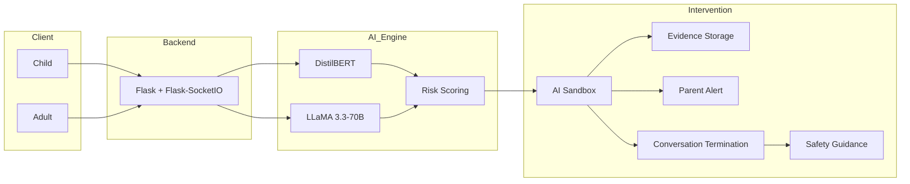

# SafeGuard AI

SafeGuard AI is a real-time AI-powered child grooming detection and intervention system that monitors online conversations, detects grooming behaviour using a fine-tuned DistilBERT model and LLaMA 3.3-70B, and automatically intervenes before online exploitation can occur.

> **Disclaimer:** This project is a research prototype developed for educational purposes. It is not intended to replace parental supervision, professional safeguarding practices, or law enforcement intervention.

---

## Features

- Real-time grooming risk detection using a fine-tuned DistilBERT classifier
- Context-aware analysis with LLaMA 3.3-70B (Groq API)
- AI Sandbox that silently intercepts high-risk conversations
- Live grooming risk visualization dashboard
- Automated parent alerts and evidence preservation
- Safe AI-generated conversation termination
- Child safety guidance after intervention
- WebSocket-based real-time messaging

---

## Tech Stack

| Category | Technologies |
|----------|--------------|
| Backend | Python, Flask, Flask-SocketIO |
| Async / Server | Gevent, Gevent-WebSocket, Gunicorn |
| AI / NLP | DistilBERT, HuggingFace Transformers, PyTorch |
| LLM | LLaMA 3.3-70B (Groq API) |
| Frontend | HTML, CSS, JavaScript |
| Notifications | Resend API |
| Deployment | Render |

---

## System Workflow

```
Chat Messages
      │
      ▼
DistilBERT Risk Classifier
      │
      ▼
LLaMA Context Analysis
      │
      ▼
Risk Scoring Engine
      │
      ▼
Threshold Detection
      │
      ▼
AI Sandbox Activation
      │
      ▼
Parent Alert + Evidence Capture
      │
      ▼
Safe Conversation Termination
```

---

## Architecture



---

## Getting Started

### 1. Clone the repository

```bash
git clone https://github.com/RachanaFPatil/Online-Grooming-Detection-and-Prevention.git
cd Online-Grooming-Detection-and-Prevention
```

### 2. Create a virtual environment

**Windows**

```bash
python -m venv venv
venv\Scripts\activate
```

**Linux / macOS**

```bash
python3 -m venv venv
source venv/bin/activate
```

### 3. Install dependencies

```bash
pip install -r requirements.txt
```

### 4. Configure environment variables

Create a `.env` file and add the required API keys.

Example:

```env
GROQ_API_KEY=your_groq_api_key
RESEND_API_KEY=your_resend_api_key
```

### 5. Run the application

```bash
python app.py
```

Open your browser and navigate to:

```
http://localhost:5000
```

---

## Demo

To experience the complete workflow:

1. Open the application in **two browser windows**.
2. Use one window as the **child** and the other as the **adult**.
3. Start a conversation.
4. Observe the live grooming risk score.
5. Continue the conversation until the intervention threshold is reached.
6. Watch the AI Sandbox activate, parent alerts trigger, and the conversation safely terminate.

---

## Project Highlights

- Fine-tuned DistilBERT model for grooming risk classification
- Context-aware reasoning using LLaMA 3.3-70B
- Multi-stage grooming risk assessment
- Silent AI Sandbox intervention
- Parent notification and evidence preservation
- Real-time communication using WebSockets

---

## Impact

SafeGuard AI combines machine learning, large language models, and real-time intervention mechanisms to identify harmful grooming behaviour early and help protect children during online interactions. The project demonstrates how AI can support digital child safety through intelligent monitoring and automated intervention.

---
